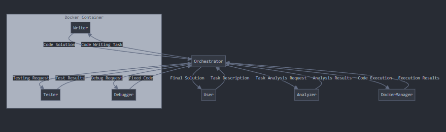

# Autonomous Coding Agent

The Autonomous Coding Assistant is a multi-agent AI system designed to automate the software development process with minimal human intervention. The system employs four specialized AI agents working together to analyze requirements, generate code, test solutions, and debug issues.




## Key Features

- Multi-agent Architecture: Specialized agents for different stages of development
- Sandboxed Execution: Secure code execution via Docker
- GPT-4 Integration: Leveraging OpenAI's advanced language models
- Structured Output: Well-formatted, documented code and comprehensive reports
- End-to-end Automation: From task description to working solution

## Use Cases

- Rapid prototyping
- Automating routine coding tasks
- Educational tool for learning programming concepts
- Accelerating development workflows
- Code optimization and refactoring

## System Architecture 
```
┌─────────────────┐
│                 │
│      User       │
│                 │
└────────┬────────┘
         │
         ▼
┌─────────────────┐
│                 │
│   Orchestrator  │
│                 │
└────┬───┬───┬────┘
     │   │   │
     ▼   ▼   ▼
┌─────┐ ┌─────┐ ┌─────┐ ┌─────┐
│     │ │     │ │     │ │     │
│  A  │ │  W  │ │  T  │ │  D  │
│     │ │     │ │     │ │     │
└─────┘ └─────┘ └─────┘ └─────┘
Analyzer Writer Tester Debugger
```
Workflow

1. User provides a task description
2. Analyzer agent breaks down the task into structured requirements
3. Writer agent generates code based on analysis
4. Tester agent creates and runs tests against the code
5. Debugger agent fixes any issues found during testing
6. Orchestrator coordinates the workflow and returns the final solution

## Data Flow

- Each agent communicates via structured JSON objects
- The orchestrator maintains a conversation history for context
- Docker containers execute code in isolation for security
- Results and artifacts are stored in the output directory

## Component Breakdown

### Orchestrator

The orchestrator is the central component that manages workflow between agents and handles user interaction. Key responsibilities include:

- Processing user task descriptions
- Coordinating agent interactions
- Maintaining conversation context
- Executing code safely in Docker containers
- Compiling and presenting results

### Key methods:

- process_task(): Main workflow method
- _execute_in_docker(): Safe code execution
- _add_to_history(): Context management

### Analyzer Agent
The analyzer agent breaks down the user's requirements into structured specifications. It delivers:

- Main objective interpretation
- Programming language recommendations
- Key feature identification
- Library/framework suggestions
- Input/output specifications
- Edge case identification
- Implementation steps

### Writer Agent
The writer agent generates code based on the analyzer's specifications. Features include:

- Complete, working code generation
- Proper imports and dependencies
- Clear code comments and documentation
- Error handling implementation
- Type hints (where applicable)
- Structured file organization

### Tester Agent
The tester agent creates and runs tests to verify the code's functionality. Capabilities include:

- Comprehensive test case generation
- Edge case testing
- Error handling verification
- Test execution in isolated environments
- Detailed test reports
- Failure analysis and suggestions

### Debugger Agent
The debugger agent identifies and fixes issues found during testing. Key features:

- Automated bug identification
- Code repair based on test results
- Explanation of changes made
- Improvement suggestions
- Performance optimizations


## Example Usage
```
python main.py --task "Create a function that calculates the Fibonacci sequence up to n terms"

```
## Output Structure
The system generates the following outputs in the specified directory:

- analysis.json: Structured analysis of the task
- initial_code.<ext>: Initial code generated by the writer agent
- test_results.json: Results from the testing phase
- final_code.<ext>: Final code after debugging and optimization
- execution_result.json: Results from executing the code
- report.md: Comprehensive report of the entire process

## Advanced Features 
Supported Programming Languages
The system can work with multiple programming languages including:

- Python
- JavaScript
- Java
- C#
- Go

The analyzer agent will recommend the most suitable language for the task, but you can specify a preference in your task description.